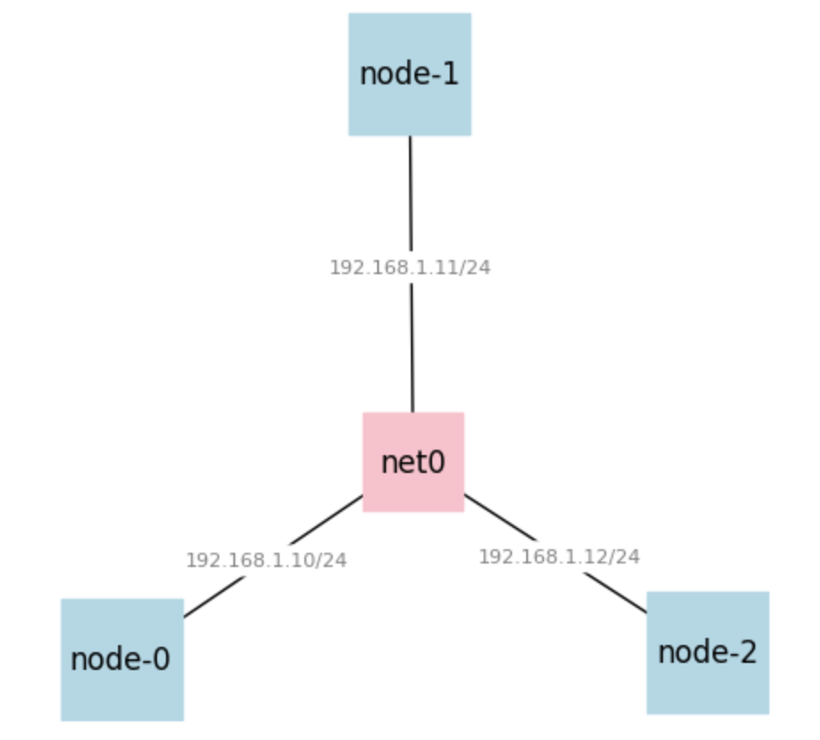

## ML Flow 

This repository serves as a demonstration of a data streaming pipeline involving the simulation of real-time streaming events. The pipeline is built using a static object store and employs Redpanda as the messaging system for producer-consumer interactions.

## Setting up the VMs on Chameleon Cloud

This experiment assumes you have already completed  [Hello, Chameleon](https://teaching-on-testbeds.github.io/blog/hello-chameleon), so you have set up your Chameleon account, created and added keys to your account, and joined an active project on Chameleon.

Running the  `reserve_chameleon.ipynb` notebook intiatialize the 3 node setup for you to run your experiments. From the [Chameleon website](https://chameleoncloud.org/), click on "Experiment > Jupyter Interface" in the menu. You may be prompted to log in. You will then upload the `reserve_chameleon.ipynb` and run all cells to launch the VMs

If your notebook runs without any issues you will see an output in the "Network Topolgy" section that looks like this:




* Node0 - TODO: Apache Flink
* Node1: Serves as the Minio Store
* Node2: Serves as the Postgres Store

Note: Currently we run both producer and consumer on node-1 but will be moved out that host in the final repo 

## Set up MinIO artifact store on Node 1
  

On node-1 run:

```
docker compose -f /home/docker-compose-minio.yaml up -d

```

This will create an artifact store and also initialize and empty bucket named `flight-info` on node1

## Setting up Postgres server on Node 2


Finally on node-2 run 
```
docker compose -f /home/docker-compose-postgres.yaml up -d
```

You can do a `docker ps` to check if the postgres server is succesfully up and running. 

## Setting up the RedPanda brokers on Node1 

```
docker compose -f /home/docker-compose-redpanda.yaml up -d
```

This should create a redpanda broker that runs on `192.168.1.11:9092`. Run a  `docker ps` to verify the container name redpanda. 

To create a new topic `flight-info` run: 

```
docker exec -it <container_id> rpk topic create flight-info
```


###  Notes

1. Move the data to Minio S3 store
2. Create a Redpanda broker and a topic 
3. Producer reads every row and pushes it to the topic every 0.5 seconds
4. Consumer consumers from the topic every 1 second and inserts it into postgres running on node2 


This material is based upon work supported by the National Science Foundation under Grant No. 2230079.
